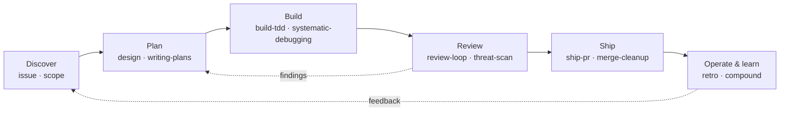

# Multi-Agent Configuration Tools

Public shared configuration for Claude Code, Codex, and IBM Bob.

This repository combines common development standards, language references,
one shared workflow-skill inventory, and agent-native settings without
committing host-specific configuration.

## SDLC workflows

The shared skills provide composable workflows across the software development
lifecycle. Claude Code, Codex, and IBM Bob install the same canonical packages
and expose them through their native skill interfaces.



<table>
  <thead>
    <tr>
      <th>Phase</th>
      <th>Outcome</th>
      <th>Representative skills</th>
    </tr>
  </thead>
  <tbody>
    <tr>
      <td>Discover</td>
      <td>Find, record, triage, and size work</td>
      <td><code>groom</code>, <code>issue</code>, <code>triage-issues</code>,
        <code>scope</code></td>
    </tr>
    <tr>
      <td>Plan</td>
      <td>Turn ideas into reviewed designs and executable plans</td>
      <td><code>brainstorming</code>, <code>epic</code>, <code>design</code>,
        <code>writing-plans</code></td>
    </tr>
    <tr>
      <td>Build</td>
      <td>Implement issues with tests and root-cause debugging</td>
      <td><code>work-issue</code>, <code>build-tdd</code>,
        <code>test-driven-development</code>, <code>systematic-debugging</code></td>
    </tr>
    <tr>
      <td>Review</td>
      <td>Challenge correctness, security, and unnecessary complexity</td>
      <td><code>challenge</code>, <code>review-loop</code>, <code>threat-scan</code>,
        <code>simplify-changes</code></td>
    </tr>
    <tr>
      <td>Ship</td>
      <td>Prepare mergeable pull requests and clean merged branches</td>
      <td><code>ship-pr</code>, <code>merge-cleanup</code></td>
    </tr>
    <tr>
      <td>Operate &amp; learn</td>
      <td>Reconcile workflow state and feed evidence into future work</td>
      <td><code>recover-orphans</code>, <code>retro</code>, <code>compound</code>,
        <code>campaign</code></td>
    </tr>
  </tbody>
</table>

These are representative paths rather than a required linear process. See the
[canonical skill inventory](content/skills/) for every installed workflow.

## Layout

- `content/` holds agent-neutral instructions, language references,
  orchestration references, and the canonical `skills/` tree installed for all
  supported agents.
- `agents/claude/shared/` holds Claude-native `CLAUDE.md`, settings, and status
  line configuration.
- `agents/codex/shared/` holds Codex-native `AGENTS.md` and config.
- `agents/bob/shared/` holds Bob-native `AGENTS.md`, settings, MCP config,
  custom modes, and rules.
- `examples/hosts/` shows private overlay shapes with placeholder values only.
- `examples/bob-project/` shows Bob project-local `.bob/` conventions.

## Vendored software

Selected agent skills are maintained forks of MIT-licensed Superpowers 6.1.1. See the
[attribution inventory](docs/licenses/superpowers.md) and
[license](docs/licenses/superpowers.LICENSE) for the exact source snapshot and covered
roots.

By submitting a change below a covered root, a contributor offers that change under the
canonical MIT terms and represents that they have authority to grant those rights.

## Install

Bootstrap local tooling:

```sh
./install-tools.sh
just setup
```

`./install-tools.sh` is the first-run path for clones that do not have `just`
yet. It checks and installs `just`, `jq`, `rg`, `shellcheck`, `shfmt`, `gh`,
`prek`, `actionlint`, and `zizmor`.

If a fallback installer places tools in a directory that was not already on your
shell `PATH`, start a new shell or add the printed tool directory before running
`just`. To install tools and enable hooks in one bootstrap step, run:

```sh
AGENT_CONFIG_SETUP_HOOKS=1 ./install-tools.sh
```

Check local tooling without installing anything:

```sh
./install-tools.sh --check
```

The tool installer supports macOS with Homebrew and Linux via `/etc/os-release`
family detection for Ubuntu/Debian, Fedora, and RHEL-family systems. It uses
package managers first, then pinned fallbacks only when the required runtime is
already installed. The zizmor wheel fallback uses 1.28.0; the Cargo source
fallback uses 1.27.0 so it remains buildable with Rust 1.88 and newer.

Set up or refresh local git hooks:

```sh
just hooks
```

Install one agent:

```sh
./install.sh --agent claude
./install.sh --agent codex
./install.sh --agent bob
```

Install all supported agents:

```sh
./install.sh --agent all
```

To test install output without touching live config directories:

```sh
tmpdir="$(mktemp -d)"
HOME="$tmpdir/home" \
CLAUDE_CONFIG_DIR="$tmpdir/home/.claude" \
CODEX_CONFIG_DIR="$tmpdir/home/.codex" \
BOB_CONFIG_DIR="$tmpdir/home/.bob" \
AGENT_CONFIG_PRIVATE_DIR="$tmpdir/private" \
AGENT_CONFIG_HOST=example-host \
./install.sh --agent all
```

Claude MCP registration is opt-in because it writes through the Claude CLI to
user-scope MCP state outside the selected config directory:

```sh
AGENT_CONFIG_REGISTER_CLAUDE_MCP=1 ./install.sh --agent claude
```

## Project-local review skills

Examples under `examples/project-review-skills/` are deliberately not globally
installed. They depend on the reviewed project's targets and declared policy, so a
project adopts the example it needs instead of adding an unfamiliar review workflow to
every agent installation.

Copy a selected review skill to its exact package path in the project's agent-native directory:

- Claude: `.claude/skills/accessibility-reviewer/`
- Codex: `.agents/skills/accessibility-reviewer/`
- Bob: `.bob/skills/accessibility-reviewer/`

For example, a project instruction can integrate the accessibility reviewer as follows:

```text
For UI-affecting changes, invoke accessibility-reviewer after normal branch review with the
same base branch or explicit file list used by that review. Disposition defensible findings,
rerun the reviewer after behavioral fixes, and treat unresolved manual checks according to this
project's accessibility policy.
```

## Private Overlays

Host overlays stay outside this public repository:

```text
${AGENT_CONFIG_PRIVATE_DIR:-$HOME/.config/agent-config}/hosts/<host>/<agent>/
```

Supported overlay files:

- Claude: `settings.overlay.json`
- Codex: `config.overlay.toml`
- Bob: `settings.overlay.json`, `mcp.overlay.json`

If an overlay is absent, the installer uses the public base and reports that no
private overlay was applied. Secrets should stay in environment variables or in
private overlay files outside this repo.

Each of the three JSON overlays must hold **exactly one JSON object**, written as UTF-8
with no byte-order mark. A file that contains a NUL byte, that begins with a BOM, that is
empty or whitespace-only, that holds more than one JSON value — two objects concatenated,
which parses but silently discards everything after the first — that holds a single value of
some other type, or that is not valid JSON at all, is refused before the merge, and the
message names the file and which of the six it is. The NUL and the BOM are called out
separately because neither is visible to jq in the way the merge needs: a BOM'd file parses
on its own — `jq . <overlay>` shows a well-formed object — and only the merge, which reads
the overlay second, stops on it; and jq's lexer stops at a NUL, so two objects separated by
one read as a single document to *both* the check and the merge. UTF-16 and UTF-32 are
caught by the NUL rule. See
[ADR 0052](docs/adr/0052-an-overlay-is-exactly-one-json-object.md).

The three JSON overlays — Claude `settings.overlay.json`, Bob `settings.overlay.json`
and `mcp.overlay.json` — are merged under one rule, stated over the result rather
than over what the overlay names: an overlay may add new keys and may override
scalars and object members, but an overlay that *changes* a path the base holds as a
non-empty array, including by extending it, or that replaces a non-empty base object
with a non-object, is refused and the path is named. That is what keeps a private
overlay from silently dropping the shared hooks and `permissions.deny` entries; see
[ADR 0043](docs/adr/0043-overlays-may-not-replace-a-base-array.md). Adding
`permissions.allow`, as `examples/hosts/example-host/` does, is unaffected — the base
defines no such key, so the overlay adds rather than replaces.

### What a refused overlay does and does not stop

A refusal fails the run — `./install.sh` exits non-zero — but it stops only the files
that overlay feeds. Everything else for that agent still installs (skills, `CLAUDE.md`,
the shared `content/` tree), and under `--agent all` the remaining agents install too.
See [ADR 0049](docs/adr/0049-a-refused-overlay-withholds-one-file.md).

For the file the overlay feeds, the installer reports what is on disk right now rather
than guessing:

- **Nothing deployed there yet** — the base is installed without your overlay, so the
  destination is guarded rather than left with no settings file at all. None of your
  overlay applies until it is fixed, and every later refused run says the deployed file
  is the base alone.
- **A file is already deployed** — it is left exactly as it is, and the installer says
  whether it still carries every value the base *protects* — the non-empty arrays and
  objects of ADR 0043, not every scalar — or names the ones it is missing. Nothing is
  written to it, so a deliberate hand edit is reported and not touched.

A deployed file that is *missing* base values is the pre-ADR-0043 clobber: an overlay
that named a protected path used to be merged silently, and that file is still live. To
get back to a correct one, fix or remove the overlay and re-run. The installer then
replaces the file and keeps the current one under
`<config-dir>/.agent-config-backups/<timestamp>/drift/`; if an earlier run replaced that
file, its predecessor is under the same directory.

There is no overlay route to *extend* a protected array, so a host-specific
`hooks.PreToolUse` entry or an extra `permissions.deny` entry has to be added to the
public base file in this repository. That is a real limit for a deny entry naming
something host-specific, since the base is public; issue #118 tracks giving hosts a
private route.

### The Codex overlay

`config.overlay.toml` is concatenated onto the base rather than merged: the base's root
settings, then the overlay's, then the base's tables, then the overlay's. It gets a
preservation guarantee of its own, stated over the *result* rather than over what the
overlay names — **every value the base defines must survive into the merged document
unchanged**. The installer parses the merged file, compares it against the parsed base, and
refuses the overlay by name if any base value is missing or different. See
[ADR 0057](docs/adr/0057-a-codex-overlay-may-not-erase-a-base-value.md).

The rule is checked over the parse because the split above is `awk` matching a leading
`[`, which is not a TOML lexer. An overlay whose root section opens a multi-line string or
array has its tail moved behind the base's tables — *inside* that value — so the base's
tables are swallowed by a file that named nothing of theirs. Such an overlay is legal TOML
and used to install at exit 0. Where the refusal is caused that way the message says the
merge split the file, rather than accusing it of erasing anything; the fix is to put that
value inside a table of its own.

Three differences from the JSON contract are worth knowing:

- **The Codex overlay is add-only.** ADR 0043 lets a JSON overlay override a base scalar;
  this does not, because concatenation has no way to express an override — writing
  `[features]` again, or a `features.goals` root key, is a duplicate declaration no TOML
  parser accepts. Changing a base value means changing the public base.
- **It needs a TOML parser.** The guarantee *is* a parse, so on a host whose `python3`
  cannot `import tomllib` — Python 3.11 added it, and stock macOS ships 3.9 — the overlay
  is refused and the run exits non-zero every time until a newer Python is installed. The
  base alone still installs where nothing is deployed yet; where a `config.toml` already
  exists it is left untouched and keeps its current contents. This replaces the previous
  behaviour on such hosts, which was to skip validation and deploy the concatenation
  unchecked.
- **An empty overlay is accepted**, where an empty JSON overlay is refused by ADR 0052. An
  empty TOML file is a valid document that defines nothing, so it erases nothing; an empty
  JSON file holds no value at all and so is not an object.

A refused Codex overlay takes the same terms as a refused JSON one: `config.toml` is
withheld and nothing else, the rest of the Codex tree and the other agents still install,
and the run exits non-zero naming the withheld path. For that file the installer reports
whether the deployed `config.toml` is the base alone or differs from it. It does not say
which base values a differing file still carries — that would need a parse, and the
refusal may be a refusal *because* there is no parser.

## IBM Bob Notes

Bob has separate global paths for some IDE and Shell settings. The installer
copies the public custom mode to both:

- `~/.bob/settings/custom_modes.yaml`
- `~/.bob/custom_modes.yaml`

It also writes MCP config to both:

- `~/.bob/mcp.json`
- `~/.bob/mcp_settings.json`

Bob project-local settings examples live under `examples/bob-project/.bob/`. Copyable
project-review skill sources live under `examples/project-review-skills/`, including the
`project-context` package shown in the Bob project instructions.

## Verification

Run the full local guardrail suite:

```sh
just verify
```

Run `just format` to apply shell formatting. Commits run the fast static gates
through the repository-owned `just commit-check` recipe (lint, format-check,
public-safety). Native pre-push verification and GitHub CI both run `just ci`,
which selects and times one complete `just verify` run.

`./install-test.sh` installs every agent into temporary directories, applies
private overlay fixtures, verifies every installed skill tree against
`content/skills/` including executable modes, checks generated files, verifies
manifest pruning, and verifies managed-file drift backup. It also covers the refused
overlay rules of ADR 0049 — the withheld path staying in the manifest, the empty
destination taking the base, and each guarded `jq` call failing closed.

`./scripts/check-skill-layout.sh` rejects agent-native workflow copies and
validates the portable structure of the canonical skill packages.

`./scripts/check-public-safety.sh` scans for denied host-specific paths, local
network addresses, auth headers, and common secret token shapes.

### Required `verify` branch check

GitHub protects `main` with the lowercase check context `verify`, bound to the
GitHub Actions app (ID `15368`). The workflow display name is `Verify`; branch
protection uses the job/check name, including its case, rather than that display
name. Administrators are subject to the same required check.

If a workflow edit renames the job or a stale required context leaves a pull
request waiting indefinitely, first run the replacement check on a real pull
request. It does not need to merge. Copy the emitted name and producer only after
the replacement succeeds:

```sh
repo_name=$(gh repo view --json nameWithOwner --jq .nameWithOwner)
pr_number=19 # replace with the real pull request that emitted the replacement
gh pr checks "$pr_number" --json name,state,link,workflow
head_sha=$(gh pr view "$pr_number" --json headRefOid --jq .headRefOid)
gh api "repos/$repo_name/commits/$head_sha/check-runs" \
  --jq '.check_runs[] | {name, app_id: .app.id, app_slug: .app.slug, conclusion}'
```

The update endpoint replaces the entire required-check list. Preserve every
unrelated check when replacing the stale context, and stop if policy changes
between the read and write:

```bash
set -euo pipefail

required_url="repos/$repo_name/branches/main/protection/required_status_checks"
current_required=$(gh api "$required_url")
stale_context=verify
replacement_context=verify # replace with the successful run's exact name
replacement_app_id=15368    # replace with that run's app_id

if ! jq -e --arg stale "$stale_context" \
  --arg replacement "$replacement_context" \
  '([.checks[] | select(.context == $stale)] | length == 1) and
   ([.checks[] | select(
      .context == $replacement and .context != $stale)] | length == 0)' \
  <<<"$current_required"; then
  printf '%s\n' 'stale or replacement context is ambiguous; inspect and retry' >&2
  exit 1
fi
if ! replacement=$(jq \
  --arg stale "$stale_context" \
  --arg context "$replacement_context" \
  --argjson app_id "$replacement_app_id" \
  '{
    strict,
    checks: [.checks[] |
      if .context == $stale
      then {context: $context, app_id: $app_id}
      else .
      end]
  }' <<<"$current_required"); then
  printf '%s\n' 'could not build the replacement policy; nothing was written' >&2
  exit 1
fi

live_required=$(gh api "$required_url")
current_snapshot=$(jq -cS '{strict, checks}' <<<"$current_required")
live_snapshot=$(jq -cS '{strict, checks}' <<<"$live_required")
if [[ "$live_snapshot" != "$current_snapshot" ]]; then
  printf '%s\n' 'required checks changed during recovery; inspect and retry' >&2
  exit 1
fi

gh api --method PATCH "$required_url" --input - <<<"$replacement"
updated_required=$(gh api "$required_url")
updated_snapshot=$(jq -cS '{strict, checks}' <<<"$updated_required")
expected_snapshot=$(jq -cS . <<<"$replacement")
if [[ "$updated_snapshot" != "$expected_snapshot" ]]; then
  printf '%s\n' 'required-check read-back differs; inspect before another write' >&2
  exit 1
fi
```

Confirm the replacement PR becomes unblocked. Do not clear all required checks as
a workaround: that recreates the unprotected merge path. Patching this endpoint
preserves other branch-protection features; constructing and asserting the complete
required-check list preserves other required checks when one administrator owns the
write window. The endpoint has no conditional-write step verified by this workflow,
so coordinate a short maintenance window and do not run this recipe concurrently with
another policy edit. The before/after snapshots detect observed drift but cannot make
an unconditional PATCH race-free; retain them for reconciliation if another edit occurs.

## Decision Records

Architecture decisions live in `docs/adr/`; explicitly deferred work lives in
`docs/debt/`. Number the two directories independently: list the numbered files
in the relevant directory and increment its highest four-digit prefix. Do not
maintain a hand-written index.

An ADR is named `NNNN-slug.md`, starts with `# NNNN — Title`, and has non-empty
`## Status`, `## Context`, `## Decision`, `## Consequences`, and
`## Considered & rejected` sections. Its status is `Proposed`, `Deferred`, or
`Accepted`, `Rejected`, or `Superseded` followed by an ISO date in parentheses.
Record supersession in the old ADR with this status banner, pointing to the new
ADR:

```markdown
> **Superseded by [NNNN](NNNN-slug.md)** (YYYY-MM-DD)
```

A debt record uses the same file and title convention. It has non-empty
`## Status`, `## Concern`, `## Why deferred`, `## Non-regression boundary`,
`## What would resolve it`, and `## Provenance` sections. Open records use an
`Open` status followed by `review-by: YYYY-MM-DD`. Provenance includes at least
one `target: path` line. Resolve a record in place by removing `review-by:` and
replacing `Open` with:

```markdown
> **Resolved by <what>** (YYYY-MM-DD)
```

Merged records are append-only except for their lifecycle markers. Create a new
ADR instead of rewriting an accepted decision; supersede the old one when the
new decision is accepted. Resolve debt in place when its stated condition is
met.

If a numbering collision or mistake requires renumbering a merged record, move it
to an unused four-digit number and update the H1 number in the same change. Do
not alter substantive text. The gate accepts the move only when the destination
did not exist at the base commit and canonicalized content is identical;
marker-only normalization may accompany it. New records still increment the
highest current number in their own directory.

For legacy records, preview marker-only migrations before writing them:

```sh
RECORD_PROFILES="adr debt" ./.github/scripts/migrate-records.sh
RECORD_PROFILES="adr debt" ./.github/scripts/migrate-records.sh --write
```

Review every item the dry run leaves for a human. For a missing lifecycle date,
inspect repository history:

```sh
git log --follow --format=%cs -- <record>
```

Add the date of the commit that established the lifecycle state; do not invent
the current date. Apply the marker rewrites with `--write`, then make the
evidenced Status or required-section completion in the same dedicated migration
commit without rewriting existing prose.

Include every printed `Migrated-markers:` trailer; those trailers enumerate the
automatic marker rewrites, not the required human completions. Run `just verify`
after creating, superseding, resolving, or migrating a record.

The root package under `.github/scripts/` owns the repository gate. Its checker,
suite, migrator, and `adr` and `debt` profiles must remain byte-identical to the
canonical copies under `content/skills/decision-records/assets/`; `just records`
checks that invariant. GitHub requires the producer-bound lowercase `verify` check on
`main`; issue #16 records the failing-PR enforcement proof and recovery procedure.

The ADR profile normally warns when `docs/adr/README.md` contains a hand-maintained
numbered index because the directory is the index. An adopting repository whose own
required CI enforces ADR-to-index agreement sets `ADR_INDEX_POLICY: required` beside
`RECORD_PROFILES` in its records workflow; that declaration suppresses only the
conflicting index warning.

## License

This repository is available under the [MIT License](LICENSE). Third-party and derived
components retain their applicable notices, including the
[Superpowers-derived skill attribution](docs/licenses/superpowers.md).

## Source Material

This repo was designed from the existing local Claude Code and Codex config
repositories plus public IBM Bob documentation and examples:

- IBM Bob custom modes: https://bob.ibm.com/docs/ide/configuration/custom-modes
- IBM Bob Shell custom modes:
  https://bob.ibm.com/docs/shell/configuration/custom-modes-bobshell
- IBM Bob skills: https://bob.ibm.com/docs/ide/features/skills
- IBM Bob rules: https://bob.ibm.com/docs/ide/configuration/rules
- IBM Bob IDE MCP: https://bob.ibm.com/docs/ide/configuration/mcp/mcp-in-bob
- IBM Bob Shell MCP: https://bob.ibm.com/docs/shell/configuration/mcp/mcp-bobshell
