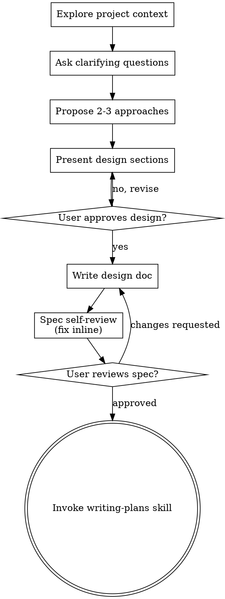

# Brainstorming Ideas Into Designs

Help turn ideas into fully formed designs and specs through natural collaborative dialogue.

Start by understanding the current project context, then ask questions one at a time to refine the idea. Once you understand what you're building, present the design and get user approval.

<HARD-GATE>
Do NOT invoke any implementation skill, write any code, scaffold any project, or take any implementation action until you have presented a design and the user has approved it. This applies to EVERY project regardless of perceived simplicity. In dispatched mode (below) the approved requirement arrives with your instructions, and the gate is satisfied by it — read that section before treating this gate as a stop.
</HARD-GATE>

## Dispatched workflow mode — sequencing, not interaction

**You are in dispatched mode when your instructions came from a curated skill (`$design`, `$work-issue`) or from an orchestrator that dispatched you — not from a human typing in this turn.** Otherwise assume a human is present and follow the rest of this skill as written. Do not try to infer the mode: your caller states it. Mode is a property of the run, not of the skill, so every skill you invoke downstream inherits it. Name the resolved mode when you announce the skill.

Dispatched mode controls workflow sequencing. It does not establish whether a human is
reachable. Inherit the separate root `interaction` value and the complete frozen scope
charter from the caller. Never infer unattended interaction from nesting.

The caller owns approval gates, so each gate below has a dispatched replacement:

| Gate as written | In dispatched mode |
|---|---|
| `HARD-GATE` — user approves the design | The frozen external charter **is** the approved requirement. Its provenance identifies the issue, direct request, linked decisions, and later user answers that authorize it. |
| Checklist 3 — ask clarifying questions one at a time | Return every design-changing ambiguity through `SCOPE CHECKPOINT`. The interactive root asks; the unattended root parks. Record only non-design-changing assumptions in the spec. |
| Checklist 5 — approval after each design section | Write the sections. There is no per-section approval. |
| Checklist 8 / **User Review Gate** — ask the user to review the spec, "Wait for the user's response" | `$design` step 3 replaces it: an adversarial `$review-loop` over the spec file. Do not wait. |
| Checklist 2 / **Visual Companion** offer | Never applies — it requires a browser a human is looking at. Do not offer it. |
| Checklist 9 / terminal state — invoke `writing-plans` | **Return to your caller instead.** See below. |

**Do not invoke `writing-plans` yourself.** `$design` owns the sequence: step 1 is this skill, step 2 adversarially reviews the ADR, step 3 adversarially reviews the spec, and only step 4 invokes `writing-plans`. Chaining straight to `writing-plans` from here skips both review gates. Your terminal state in dispatched mode is a spec (and, where the decision warrants one, an ADR) written, committed, and reported to the caller by path.

Everything else in this skill still applies: exploring project context, the scope check and decomposition advice, proposing and weighing 2-3 approaches, designing for isolation and clarity, the spec self-review, and YAGNI. Dispatched mode removes the waiting, not the thinking.

### Scope checkpoint return

Carry all charter values unchanged. A missing, incomplete, or unresolvable field takes this
same path and never derives authority from the proposed design:

In dispatched mode, send design-changing ambiguity to SCOPE CHECKPOINT; never choose inline.

SCOPE CHECKPOINT
interaction: <unchanged root value>
scope identity: <external scope identity, never reviewed target>
outcome: <frozen external outcome>
completion criteria: <frozen external completion criteria>
provenance: <external source for every outcome, criterion, and user decision>
exclusions: <frozen external exclusions>
surface: <frozen permitted surface>
ambiguities: <frozen ambiguity list>
question: <one design-selecting question>
why design-changing: <affected scope field or normative guarantee>

An interactive caller asks the returned question and re-freezes the charter with the
answer and provenance. An unattended caller parks for human input.

## Anti-Pattern: "This Is Too Simple To Need A Design"

Every project goes through this process. A todo list, a single-function utility, a config change — all of them. "Simple" projects are where unexamined assumptions cause the most wasted work. The design can be short (a few sentences for truly simple projects), but you MUST present it and get approval.

In dispatched mode the design still gets written — brevity is not the carve-out. The frozen
external charter supplies the approved requirement, and the caller's adversarial review
checks the spec without expanding that authority.

## Checklist

You MUST create a task for each of these items and complete them in order. In dispatched mode, items 2, 3, 5, 8 and 9 change — see the table above before you create the tasks, so the list you build is the one you can actually finish.

1. **Explore project context** — check files, docs, recent commits
2. **Offer the visual companion just-in-time** — NOT upfront. The first time a question would genuinely be clearer shown than described, offer it then (its own message); on approval its browser tab opens for you. If no visual question ever arises, never offer it. See the Visual Companion section below.
3. **Ask clarifying questions** — one at a time, understand purpose/constraints/success criteria
4. **Propose 2-3 approaches** — with trade-offs and your recommendation
5. **Present design** — in sections scaled to their complexity, get user approval after each section
6. **Write design doc** — save to `docs/superpowers/specs/YYYY-MM-DD-<topic>-design.md` and commit
7. **Spec self-review** — quick inline check for placeholders, contradictions, ambiguity, scope (see below)
8. **User reviews written spec** — ask user to review the spec file before proceeding
9. **Transition to implementation** — invoke writing-plans skill to create implementation plan

## Process Flow

**The terminal state is invoking writing-plans.** Do NOT invoke frontend-design or any other implementation skill. The ONLY skill you invoke after brainstorming is writing-plans.

**In dispatched mode, the caller owns two nodes above.** The "User approves design?" and
"User reviews spec?" diamonds are replaced by the caller's external charter and review
steps. Return to the caller rather than invoking `writing-plans`. See Dispatched mode.

## The Process

**Understanding the idea:**

- Check out the current project state first (files, docs, recent commits)
- Before asking detailed questions, assess scope: if the request describes multiple independent subsystems (e.g., "build a platform with chat, file storage, billing, and analytics"), flag this immediately. Don't spend questions refining details of a project that needs to be decomposed first.
- If the project is too large for a single spec, help the user decompose into sub-projects: what are the independent pieces, how do they relate, what order should they be built? Then brainstorm the first sub-project through the normal design flow. Each sub-project gets its own spec → plan → implementation cycle.
- For appropriately-scoped projects, ask questions one at a time to refine the idea
- Prefer multiple choice questions when possible, but open-ended is fine too
- Only one question per message - if a topic needs more exploration, break it into multiple questions
- Focus on understanding: purpose, constraints, success criteria

**Exploring approaches:**

- Propose 2-3 different approaches with trade-offs
- Present options conversationally with your recommendation and reasoning
- Lead with your recommended option and explain why

**Presenting the design:**

- Once you believe you understand what you're building, present the design
- Scale each section to its complexity: a few sentences if straightforward, up to 200-300 words if nuanced
- Ask after each section whether it looks right so far
- Cover: architecture, components, data flow, error handling, testing
- Be ready to go back and clarify if something doesn't make sense

**Design for isolation and clarity:**

- Break the system into smaller units that each have one clear purpose, communicate through well-defined interfaces, and can be understood and tested independently
- For each unit, you should be able to answer: what does it do, how do you use it, and what does it depend on?
- Can someone understand what a unit does without reading its internals? Can you change the internals without breaking consumers? If not, the boundaries need work.
- Smaller, well-bounded units are also easier for you to work with - you reason better about code you can hold in context at once, and your edits are more reliable when files are focused. When a file grows large, that's often a signal that it's doing too much.

**Working in existing codebases:**

- Explore the current structure before proposing changes. Follow existing patterns.
- Where existing code has problems that affect the work (e.g., a file that's grown too large, unclear boundaries, tangled responsibilities), include targeted improvements as part of the design - the way a good developer improves code they're working in.
- Don't propose unrelated refactoring. Stay focused on what serves the current goal.

## After the Design

**Documentation:**

- Write the validated design (spec) to `docs/superpowers/specs/YYYY-MM-DD-<topic>-design.md`
  - (User preferences for spec location override this default)
- Commit the design document to git

**Spec Self-Review:**
After writing the spec document, look at it with fresh eyes:

1. **Placeholder scan:** Any "TBD", "TODO", incomplete sections, or vague requirements? Fix them.
2. **Internal consistency:** Do any sections contradict each other? Does the architecture match the feature descriptions?
3. **Scope check:** Is this focused enough for a single implementation plan, or does it need decomposition?
4. **Ambiguity check:** Could any requirement be interpreted two different ways? In
   dispatched mode, return an interpretation that changes a charter field or normative
   guarantee through `SCOPE CHECKPOINT`. Pick and document an interpretation inline only
   when it is explicitly non-design-changing.

Fix non-design-changing issues inline. A `SCOPE CHECKPOINT` returns to the caller before
the spec can continue. No additional self-review pass is required for inline fixes.

**User Review Gate:**
After the spec review loop passes, ask the user to review the written spec before proceeding:

> "Spec written and committed to `<path>`. Please review it and let me know if you want to make any changes before we start writing out the implementation plan."

Wait for the user's response. If they request changes, make them and re-run the spec review loop. Only proceed once the user approves.

**In dispatched mode, skip this gate** — the caller owns it, and an adversarial review of
the spec file runs there instead (`$design` step 3).

**Implementation:**

- Invoke the writing-plans skill to create a detailed implementation plan
- Do NOT invoke any other skill. writing-plans is the next step.
- **In dispatched mode, invoke nothing.** Report the spec path to your caller and return; it sequences the reviews and the plan.

## Key Principles

- **One question at a time** - Don't overwhelm with multiple questions
- **Multiple choice preferred** - Easier to answer than open-ended when possible
- **YAGNI ruthlessly** - Remove unnecessary features from all designs
- **Explore alternatives** - Always propose 2-3 approaches before settling
- **Incremental validation** - Present design, get approval before moving on
- **Be flexible** - Go back and clarify when something doesn't make sense

The first, second and fifth of these describe a conversation. In dispatched mode the caller
owns that conversation: the frozen charter carries the requirement, design-changing
ambiguity returns through `SCOPE CHECKPOINT`, and validation is the caller's adversarial
review of the written spec. YAGNI and exploring alternatives apply unchanged.

## Visual Companion

A browser-based companion for showing mockups, diagrams, and visual options during brainstorming. Available as a tool — not a mode. Accepting the companion means it's available for questions that benefit from visual treatment; it does NOT mean every question goes through the browser.

**Never offer it in dispatched mode.** The offer must be its own message and then wait for a reply, and there is no one to reply or to look at the browser tab.

**Offering the companion (just-in-time):** Do NOT offer it upfront. Wait until a question would genuinely be clearer shown than told — a real mockup / layout / diagram question, not merely a UI *topic*. The first time that happens, offer it then, as its own message:
> "This next part might be easier if I show you — I can put together mockups, diagrams, and comparisons in a browser tab as we go. It's still new and can be token-intensive. Want me to? I'll open it for you."

**This offer MUST be its own message.** Only the offer — no clarifying question, summary, or other content. Wait for the user's response. If they accept, start the server with `--open` so their browser opens to the first screen automatically. If they decline, continue text-only and don't offer again unless they raise it.

**Per-question decision:** Even after the user accepts, decide FOR EACH QUESTION whether to use the browser or the terminal. The test: **would the user understand this better by seeing it than reading it?**

- **Use the browser** for content that IS visual — mockups, wireframes, layout comparisons, architecture diagrams, side-by-side visual designs
- **Use the terminal** for content that is text — requirements questions, conceptual choices, tradeoff lists, A/B/C/D text options, scope decisions

A question about a UI topic is not automatically a visual question. "What does personality mean in this context?" is a conceptual question — use the terminal. "Which wizard layout works better?" is a visual question — use the browser.

If they agree to the companion, read the detailed guide before proceeding:
`skills/brainstorming/visual-companion.md`
